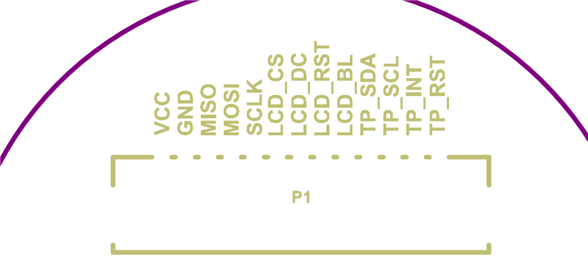
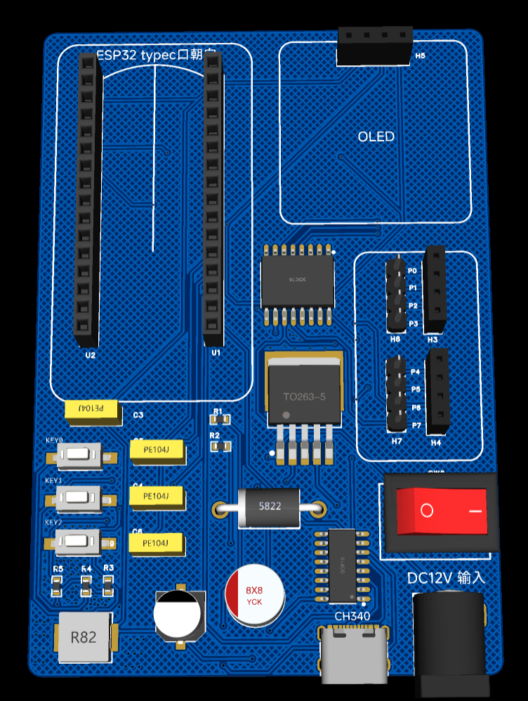

   

# References

[IRF520](https://forum.hobbycomponents.com/viewtopic.php?f=76&t=1872)

[ESP32S3-TOUCHLCD](https://www.waveshare.net/wiki/ESP32-S3-Touch-LCD-1.28)

# Explanations

## `01_Softwares`

**软件工程**。

### `sketch_may29a`

**最初的版本**，使用Arduino，直接使用IO口驱动电路板，没有考虑到红绿灯的工作电压与IO口数量的问题。

### `Traffic_Light_Control_Upper`

交通信号灯上位机MQTT通信协议验证程序。

### `traffic_light_mpy`

为带有TFT的ESP32S3编写的MicroPython版本，参考微雪例程。

### `traffic_light_mpy2`

为不带有TFT屏幕的ESP32编写的MicroPython版本，增加了很多异常处理机制与执行状态。

## `02_Hardwares`

~~**硬件工程**，第四版成功搞坏了一个ESP32C3。~~

**由于PCB不管怎么焊接都会出现差错，为了快速成型，使用面包板与杜邦线方案，不再设计PCB。**

## `03_Documents`

**所有文档**。原理图与PCB，其中报废版本与过渡版本省略未传。