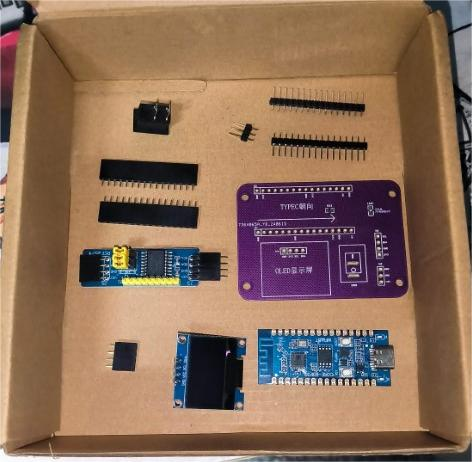

# :thinking: Welcome to Traffic Light Controllers

   

# Preview

# Explanations

## `01_Softwares`

**软件工程**。

### `sketch_may29a`

最初的版本，直接使用IO口驱动电路板，没有考虑到红绿灯的工作电压与IO口数量的问题。

后续拟采用IIC控制IO扩展板，再进一步接入NMOS灯驱动方案驱动红绿灯。

### `Traffic_Light_Control_Upper`

交通信号灯上位机MQTT通信协议验证程序。

## `02_Hardwares`

**硬件工程**。为了减轻焊接工作，交通信号灯第四版中没有设计出IC芯片，而是采用转接版设计，兼容合宙ESP32-C3。

PCB中只引出了ESP32的IIC接口，控制一个I2C SSD1306 OLED屏幕和一个8端口IO扩展模块，但是如果红绿灯的工作电压不匹配，将考虑用NMOS管灯驱动。

其中5v接口是供电接口，在交通灯PCB板和电源模块用铜柱和螺丝钉固定，但不幸的是电源模块坏掉了。

交通信号灯转接板第三版已焊接，但是出现设计问题，已报废，第一版未焊接，难度较大，第四版将尽快焊接。

考虑到电源IC焊接问题，后续设计拟采用DIP封装的电源IC或者继续沿用电源模块。

## 03_Documents

**所有文档**。原理图与PCB，其中报废版本与过渡版本省略未传。